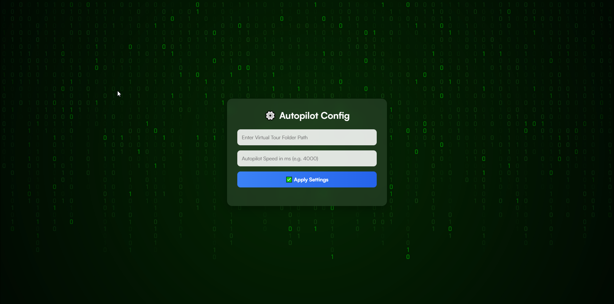

# 3D Vista Autoplay 🎬



A powerful Node.js application that automatically adds autoplay/autopilot functionality to your 3D Vista virtual tours. Transform your static virtual tours into dynamic, automatically rotating experiences with just a few clicks!

## ✨ Features

- **🎯 One-Click Setup**: Simply provide your 3D Vista project folder path
- **⚡ Turbo Mode Toggle**: Enable/disable autoplay with a sleek UI button
- **🎛️ Customizable Speed**: Set rotation speed from 1000ms to 20000ms
- **🔄 Smart Backup System**: Automatically creates backups of your original files
- **🧹 File Optimization**: Removes inline base64 PNGs to improve performance
- **📱 Responsive UI**: Modern, glassmorphism design that works on all devices
- **🔧 Safe Operations**: Non-destructive modifications with easy restoration

## 🚀 How It Works

The application intelligently modifies your `script_general.js` file by:
1. Injecting autopilot camera movements that smoothly rotate 360°
2. Adding a toggle button to your virtual tour interface
3. Creating backup files for safe restoration
4. Optimizing file sizes by cleaning up inline images

## 📋 Prerequisites

- **Node.js** (version 16.0.0 or higher)
- **npm** (comes with Node.js)
- A 3D Vista virtual tour project with `script_general.js` file

## 🛠️ Installation

1. **Clone the repository**
   ```bash
   git clone https://github.com/thiyo-de/3d-Vista-Autoplay.git
   cd 3d-Vista-Autoplay
   ```

2. **Install dependencies**
   ```bash
   npm install
   ```

3. **Start the server**
   ```bash
   npm start
   ```

4. **Open your browser**
   ```
   http://localhost:5000
   ```

## 📖 Usage Guide

### Step 1: Configure Your Project
1. Open the application in your browser
2. Enter your 3D Vista project folder path (the folder containing `script_general.js`)
3. Set your desired autoplay speed (1000-20000 milliseconds)
4. Click "✅ Apply Settings"

### Step 2: Enable Autoplay
1. Navigate to your virtual tour's `index.htm` file
2. You'll see a new "Turbo Mode" button in the bottom-left corner
3. Click the button to toggle autoplay ON/OFF
4. The tour will automatically reload with your new settings

### Step 3: Enjoy!
Your virtual tour now features smooth 360° autoplay rotation! Visitors can still interact normally while the autopilot provides a cinematic experience.

## 🎨 UI Components

### Configuration Interface
- **Modern glassmorphism design** with backdrop blur effects
- **Real-time status updates** during processing
- **Input validation** for paths and speed values
- **Responsive layout** that adapts to any screen size

### In-Tour Controls
- **Sleek toggle button** with gradient styling
- **Helpful tooltips** explaining current state
- **Smooth animations** and hover effects
- **Persistent settings** using localStorage

## 📁 Project Structure

```
3d-Vista-Autoplay/
├── server.js              # Main Express.js server
├── package.json           # Project dependencies
├── public/
│   ├── UI.html            # Configuration interface
│   └── Auto_Pilot.jpg     # Background image
└── README.md              # This file
```

## 🔧 API Endpoints

| Endpoint | Method | Description |
|----------|--------|-------------|
| `/` | GET | Redirects to configuration UI |
| `/set-path` | POST | Initialize project with folder path and speed |
| `/enable-autopilot` | POST | Activate autoplay mode |
| `/disable-autopilot` | POST | Restore original tour behavior |

## ⚙️ Configuration Options

### Speed Settings
- **Minimum**: 1000ms (fast rotation)
- **Maximum**: 20000ms (very slow rotation)
- **Recommended**: 4000-8000ms for optimal viewing experience

### File Modifications
The application creates these files in your project folder:
- `backup_script_general.js` - Original file backup
- `modified_script_general.js` - Version with autopilot injection
- Updated `index.htm` - With toggle UI controls

## 🛡️ Safety Features

- **Automatic backups** prevent data loss
- **Non-destructive operations** - original files are preserved
- **Error handling** with detailed status messages
- **File validation** ensures compatibility
- **Easy restoration** to original state

## 🎯 Browser Compatibility

- ✅ Chrome 60+
- ✅ Firefox 55+
- ✅ Safari 12+
- ✅ Edge 79+

## 🤝 Contributing

We welcome contributions! Here's how you can help:

1. **Fork the repository**
2. **Create a feature branch**: `git checkout -b feature/amazing-feature`
3. **Commit your changes**: `git commit -m 'Add amazing feature'`
4. **Push to the branch**: `git push origin feature/amazing-feature`
5. **Open a Pull Request**

## 📝 License

This project is licensed under the MIT License - see the [LICENSE](LICENSE) file for details.

## 🐛 Troubleshooting

### Common Issues

**"Missing script_general.js" error**
- Ensure you're pointing to the correct 3D Vista project folder
- The folder must contain `script_general.js` file

**"Server not responding" error**
- Check if port 5000 is available
- Try restarting the application
- Verify Node.js is properly installed

**Autoplay not working**
- Clear your browser cache and reload
- Check browser console for JavaScript errors
- Ensure the tour uses the standard 3D Vista structure

### Support

If you encounter any issues:
1. Check the [Issues](https://github.com/thiyo-de/3d-Vista-Autoplay/issues) page
2. Create a new issue with detailed description
3. Include your system information and error messages

## 🙏 Acknowledgments

- Built with ❤️ for the 3D Vista community
- Inspired by the need for cinematic virtual tour experiences
- Thanks to all contributors and users who provide feedback

## 📊 Stats


---

**Made with 🚀 by [thiyo-de](https://github.com/thiyo-de)**

*Transform your virtual tours into cinematic experiences!*
